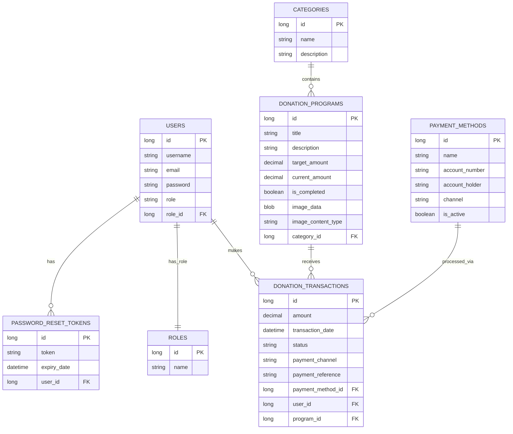

# 🟢 ZakaFlow - Sistem Informasi Pengelolaan Zakat, Infak, & Sedekah

[](https://www.oracle.com/java/)
[](https://spring.io/projects/spring-boot)
[](https://spring.io/projects/spring-security)
[](https://www.postgresql.org/)
[](https://tailwindcss.com/)
[](https://www.thymeleaf.org/)

**ZakaFlow** adalah platform digital berbasis web yang dirancang khusus untuk mengelola zakat, infak, dan sedekah secara transparan, aman, dan mudah. Aplikasi ini dibuat menggunakan arsitektur modern Spring Boot dengan fokus pada penerapan prinsip **Pemrograman Berorientasi Objek (OOP / PBO)** yang bersih dan terstruktur.

Aplikasi ini mempermudah **Muzakki (Donatur)** untuk menghitung kewajiban zakat mereka melalui kalkulator interaktif dan menyalurkannya langsung ke berbagai program donasi aktif. Di sisi lain, **Amil (Admin)** dapat mengelola program donasi, memverifikasi transaksi pembayaran, serta menganalisis laporan statistik donasi bulanan secara real-time.

---

## 📑 Daftar Isi

- [Fitur Utama](#-fitur-utama)
- [Penerapan Konsep OOP (PBO)](#-penerapan-konsep-oop-pbo)
- [Teknologi yang Digunakan](#-teknologi-yang-digunakan)
- [Struktur Database (ERD / Relational Model)](#-struktur-database-erd--relational-model)
- [Struktur Folder Project](#-struktur-folder-project)
- [Langkah Instalasi & Cara Menjalankan](#%EF%B8%8F-langkah-instalasi--cara-menjalankan)
- [Akun Percobaan Default](#-akun-percobaan-default)
- [Kontributor](#-kontributor)

---

## ✨ Fitur Utama

### 👤 1. Sistem Multi-Role & Keamanan Tingkat Tinggi
*   **Authentication & Authorization:** Dibangun dengan **Spring Security 6** untuk mengamankan data pengguna.
*   **Dua Peran Utama (Role):**
    *   **ADMIN (Amil):** Memiliki kontrol penuh atas manajemen kategori, pembuatan/pembaruan program donasi, pengelolaan pengguna, dan konfirmasi transaksi.
    *   **DONATUR (Muzakki):** Mengakses katalog program donasi, melakukan pembayaran, memantau riwayat transaksi pribadi, dan mencetak bukti kuitansi pembayaran resmi.
*   **Google OAuth2 Integration:** Opsi masuk/pendaftaran instan menggunakan akun Google.
*   **Forgot Password Flow:** Fitur reset password yang aman menggunakan secure token dengan masa kedaluwarsa.

### 🧮 2. Kalkulator Zakat Penghasilan Interaktif
*   **Perhitungan Akurat:** Membantu muzakki menghitung kewajiban Zakat Penghasilan berdasarkan penghasilan bulanan dan bonus/tunjangan.
*   **Deteksi Nisab Otomatis:** Sistem mendeteksi secara dinamis apakah total penghasilan telah mencapai batas wajib zakat (Nisab setara 85 gram emas per tahun, atau disesuaikan secara bulanan Rp 6.850.000) dengan tarif 2,5%.

### 📋 3. Manajemen Program Donasi & Kategori
*   **Katalog Terkategori:** Program donasi terbagi menjadi Zakat, Infak, dan Sedekah untuk kemudahan penyaluran.
*   **Target vs Realisasi Dana:** Bar kemajuan (progress bar) interaktif yang melacak pengumpulan dana secara dinamis untuk program non-zakat.
*   **Pengolahan Gambar Cerdas:** Admin dapat mengunggah gambar cover program yang kemudian dikompresi dan dikonversi otomatis ke format **WebP** guna mempercepat waktu pemuatan halaman.

### 💳 4. Transaksi & Simulasi Pembayaran Instan
*   **Pilihan Channel Pembayaran:** Mendukung Transfer Bank (BCA, BRI, Mandiri, BNI, BTN, BSI), QRIS, dan E-Wallet (GoPay, OVO, DANA).
*   **Upload Bukti & Verifikasi:** Donatur mengunggah referensi pembayaran untuk ditinjau oleh Admin.
*   **Simulasi Pembayaran (Development Mode):** Fitur simulasi instan bagi donatur untuk mencoba proses pembayaran langsung dari status *Pending* ke *Success* tanpa perlu verifikasi admin manual.

### 📄 5. Cetak Bukti Pembayaran Resmi (Invoice)
*   **Cetak Kuitansi:** Donatur dapat melihat detail transaksi dan mencetak bukti pembayaran dengan layout yang ramah cetak (clean PDF/print layout).

### 📈 6. Visualisasi Statistik & Laporan
*   **Grafik Interaktif:** Visualisasi statistik tren donasi bulanan pengguna menggunakan diagram batang berbasis *Thymeleaf* dan CSS premium.

---

## 💻 Penerapan Konsep OOP (PBO)

Sebagai projek Pemrograman Berorientasi Objek, **ZakaFlow** menerapkan 4 pilar utama OOP secara konsisten:

### 1. Enkapsulasi (Encapsulation)
Semua kelas model menyembunyikan status internalnya menggunakan hak akses `private` dan menyediakan metode akses yang aman melalui annotation Lombok seperti `@Data`, `@Getter`, `@Setter`.
```java
// Contoh pada com.zakaflow.zakaflow.model.User
@Entity
@Table(name = "users")
@Data // Enkapsulasi getter/setter secara otomatis
@NoArgsConstructor
public class User {
    @Id
    @GeneratedValue(strategy = GenerationType.IDENTITY)
    private Long id;

    @Column(nullable = false, unique = true)
    private String username;

    @Column(nullable = false)
    private String password;
}
```

### 2. Abstraksi (Abstraction)
Pemisahan antara kontrak interface (Service) dan detail implementasi di kelas implementasi (`ServiceImpl`). Ini mempermudah pemeliharaan kode dan modifikasi komponen di masa depan.
```java
// Kontrak Abstraksi
public interface ImageStorageService {
    String storeImage(MultipartFile file);
    byte[] convertToWebp(MultipartFile file);
}

// Detail Implementasi
@Service
public class LocalImageStorageServiceImpl implements ImageStorageService {
    @Override
    public String storeImage(MultipartFile file) {
        // Logika konversi WebP dan penyimpanan lokal
    }
    // ...
}
```

### 3. Pewarisan (Inheritance)
Menggunakan pewarisan untuk berbagi perilaku umum, seperti pewarisan dari `JpaRepository` bawaan Spring Data JPA atau memperluas kelas Exception dasar untuk Exception Handling.
```java
// Mewarisi kemampuan pencarian database bawaan Spring Data JPA
public interface UserRepository extends JpaRepository<User, Long> {
    Optional<User> findByUsername(String username);
}
```

### 4. Polimorfisme (Polymorphism)
Diterapkan melalui implementasi interface (`@Override`) dan overloading method pada service yang menangani berbagai kondisi parameter masukan (seperti perhitungan zakat yang dinamis).
```java
@Component
public class DataInitializer implements CommandLineRunner {
    @Override // Polimorfisme dinamis (Method Overriding)
    public void run(String... args) {
        // Logika inisialisasi data
    }
}
```

---

## 🛠️ Teknologi yang Digunakan

### Backend
*   **Bahasa Pemrograman:** Java (versi 21)
*   **Framework:** Spring Boot (versi 3.3.12)
*   **ORM / Data Access:** Spring Data JPA & Hibernate
*   **Security:** Spring Security 6 & OAuth2 Client
*   **Template Engine:** Thymeleaf & Thymeleaf Extras Spring Security 6
*   **Libraries:** Lombok (Penyederhanaan boilerplate code), Webp-imageio (Kompresi gambar)

### Frontend
*   **Styling:** Tailwind CSS (via CDN)
*   **Design Framework:** Clean Minimalist Glassmorphism (Palette warna: Hijau Emerald `#10b981` dan Oranye Amber `#f59e0b`)
*   **Icons & Fonts:** Google Fonts (Inter) & SVG Icons bawaan Tailwind

### Database & Environment
*   **Database:** PostgreSQL (Mendukung Supabase Cloud Database)
*   **Build Tool:** Maven

---

## 🗄️ Struktur Database (ERD / Relational Model)

Sistem menggunakan database relasional PostgreSQL dengan entitas utama sebagai berikut:



---

## 📂 Struktur Folder Project

```text
ZakaFlow-OOP-Project/
│
├── .env                              # File environment variables database
├── pom.xml                           # Konfigurasi dependensi Maven
├── src/
│   ├── main/
│   │   ├── java/com/zakaflow/zakaflow/
│   │   │   ├── DemoApplication.java  # Main entrypoint aplikasi Spring Boot
│   │   │   │
│   │   │   ├── config/               # Kelas konfigurasi (Security, DataInitializer, dll.)
│   │   │   ├── controller/           # Pengendali Request HTTP (Admin & User routes)
│   │   │   ├── model/                # Entitas database (OOP Models)
│   │   │   ├── repository/           # Data Access Layer (Spring Data JPA)
│   │   │   └── service/              # Logic layer (Service interfaces & impl)
│   │   │       ├── dto/              # Data Transfer Objects
│   │   │       └── impl/             # Implementasi konkrit dari Service
│   │   │
│   │   └── resources/
│   │       ├── application.properties         # Konfigurasi database & app properties
│   │       ├── application.properties.example # Contoh konfigurasi properties
│   │       ├── static/                        # File aset statis (CSS, JS, Gambar)
│   │       └── templates/                     # Halaman web Thymeleaf (HTML)
│   │
│   └── test/                         # JUnit & Spring Security Unit Testing
```

---

## ⚙️ Langkah Instalasi & Cara Menjalankan

Ikuti panduan berikut untuk menjalankan ZakaFlow di komputer lokal Anda:

### 1. Prasyarat Sistem
Pastikan Anda sudah menginstal perangkat lunak berikut:
*   [Java Development Kit (JDK) 21](https://adoptium.net/temurin/releases/?version=21)
*   [Apache Maven 3.x](https://maven.apache.org/download.cgi) (atau gunakan wrapper `./mvnw` bawaan project)
*   [PostgreSQL Database](https://www.postgresql.org/) (Lokal atau menggunakan Supabase)

### 2. Kloning Repositori
```bash
git clone https://github.com/muhammaddiaz13/ZakaFlow-OOP-Project.git
cd ZakaFlow-OOP-Project
```

### 3. Konfigurasi Database
Salin file konfigurasi contoh untuk membuat konfigurasi aktif Anda:
1.  Buat file `application.properties` di dalam direktori `src/main/resources/` (atau gunakan file `.env` jika digunakan di lingkungan Anda).
2.  Sesuaikan kredensial koneksi database PostgreSQL Anda:
    ```properties
    spring.datasource.url=jdbc:postgresql://localhost:5432/zakaflow_db
    spring.datasource.username=postgres
    spring.datasource.password=your_secure_password
    spring.jpa.hibernate.ddl-auto=update
    spring.jpa.show-sql=true
    ```

### 4. Build dan Jalankan Aplikasi
Gunakan perintah Maven Wrapper di terminal untuk mengompilasi dan menjalankan program:
*   **Di Windows (Command Prompt / PowerShell):**
    ```powershell
    .\mvnw.cmd spring-boot:run
    ```
*   **Di Linux / macOS:**
    ```bash
    chmod +x mvnw
    ./mvnw spring-boot:run
    ```

Setelah aplikasi berjalan dengan sukses, buka peramban web (browser) Anda dan akses alamat:
👉 **[http://localhost:8080](http://localhost:8080)**

---

## 🔑 Akun Percobaan Default

Saat pertama kali dijalankan, sistem secara otomatis menginisialisasi database dengan data awal (*seeding*), termasuk dua akun uji coba bawaan:

| Role | Username | Password | Deskripsi Fitur Akses |
| :--- | :--- | :--- | :--- |
| **ADMIN** | `admin` | `admin123` | Masuk ke dashboard admin, membuat program donasi baru, konfirmasi transaksi pembayaran donatur, kelola kategori. |
| **DONATUR** | `donatur` | `donatur123` | Simulasi pembayaran zakat/sedekah, lihat riwayat transaksi pribadi, edit profil, cetak kuitansi. |

---

## 👥 Kontributor

Projek ini dikembangkan sebagai tugas besar mata kuliah Pemrograman Berorientasi Objek (PBO) Semester 4.

*   **Muhammad Diaz** ([@muhammaddiaz13](https://github.com/muhammaddiaz13)) - Lead Backend Developer & UI Designer.

---
*Dibuat dengan 💚 oleh Tim ZakaFlow.*
